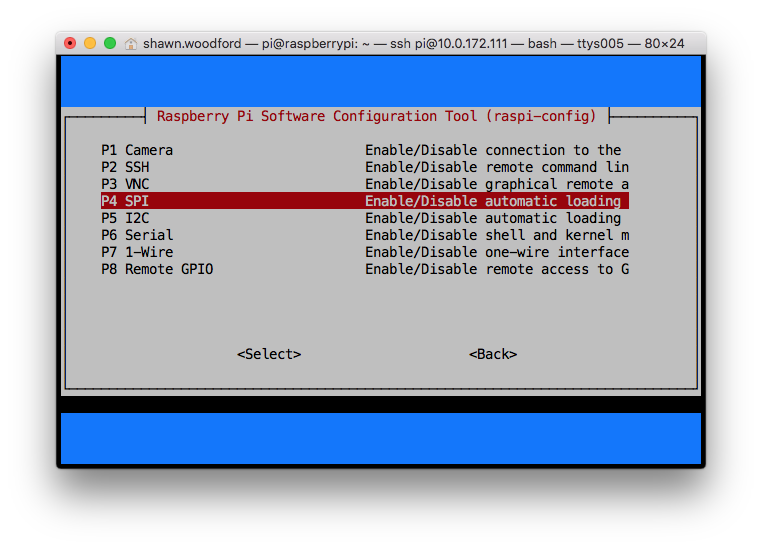

Installation
------------
.. note:: The library has been tested against Python 2.7 and 3.4+.

   For a **Python 3** installation, substitute the following in the 
   instructions below.

   * ``pip`` ⇒ ``pip3``, 
   * ``python`` ⇒ ``python3``, 
   * ``python-dev`` ⇒ ``python3-dev``,
   * ``python-pip`` ⇒ ``python3-pip``.

Pre-requisites
^^^^^^^^^^^^^^

MAX7219 Devices
"""""""""""""""
By default, the SPI kernel driver is **NOT** enabled on a Raspberry Pi Raspbian image.
You can confirm whether it is enabled using the shell command below::

  $ lsmod | grep -i spi
  spi_bcm2835             7424  0

Depending on the hardware/kernel version, this may report **spi_bcm2807** rather 
than **spi_bcm2835** - either should be adequate.

And to verify that the devices are successfully installed in ``/dev``::

  $ ls -l /dev/spi*
  crw------- 1 root root 153, 0 Jan  1  1970 /dev/spidev0.0
  crw------- 1 root root 153, 1 Jan  1  1970 /dev/spidev0.1

If you have no ``/dev/spi`` files and nothing is showing using ``lsmod`` then this
implies the kernel SPI driver is not loaded. Enable the SPI as follows (steps
taken from https://learn.sparkfun.com/tutorials/raspberry-pi-spi-and-i2c-tutorial#spi-on-pi):

#. Run ``sudo raspi-config``
#. Use the down arrow to select ``5 Interfacing Options``
#. Arrow down to ``P4 SPI``
#. Select **yes** when it asks you to enable SPI
#. Also select **yes** when it asks about automatically loading the kernel module
#. Use the right arrow to select the **<Finish>** button
#. Reboot.

After rebooting re-check that the ``lsmod | grep -i spi`` command shows whether
SPI driver is loaded before proceeding. If you are stil experiencing problems, refer to the official 
Raspberry Pi `SPI troubleshooting guide <https://www.raspberrypi.org/documentation/hardware/raspberrypi/spi/README.md#troubleshooting>`_
for further details, or ask a `new question <https://github.com/rm-hull/luma.led_matrix/issues/new>`_ - but
please remember to add as much detail as possible.

GPIO pin-outs
^^^^^^^^^^^^^

MAX7219 Devices (SPI)
"""""""""""""""""""""
The breakout board has two headers to allow daisy-chaining:

============ ====== ============= ========= ====================
Board Pin    Name   Remarks       RPi Pin   RPi Function
------------ ------ ------------- --------- --------------------
1            VCC    +5V Power     2         5V0
2            GND    Ground        6         GND
3            DIN    Data In       19        GPIO 10 (MOSI)
4            CS     Chip Select   24        GPIO 8 (SPI CE0)
5            CLK    Clock         23        GPIO 11 (SPI CLK)
============ ====== ============= ========= ====================

.. seealso:: Also see the section for :doc:`cascading/daisy-chaining <python-usage>`, power supply and
   level-shifting.

WS2812 NeoPixels (DMA)
""""""""""""""""""""""
Typically, WS2812 NeoPixels reqire VCC, VSS (GND) and DI pins connecting to the
Raspberry Pi, where the DI pin is usually connected to a PWM control pin such
as GPIO 18.

============ ====== ============= ========= ====================
Board Pin    Name   Remarks       RPi Pin   RPi Function
------------ ------ ------------- --------- --------------------
1            DO     Data Out      -         -
2            DI     Data In       12        GPIO 18 (PWM0)
3            VCC    +5V Power     2         5V0
4            NC     Not connected -         -
5            VDD    Not connected -         -
6            VSS    Ground        6         GND
============ ====== ============= ========= ====================

The DO pin should be connected to the DI pin on the next (daisy-chained)
neopixel, while the VCC and VSS are supplied in-parallel to all LED's.
WS2812b devices now are becoming more prevalent, and only have 4 pins.

NeoSegments
"""""""""""
@msurguy's NeoSegments should be connected as follows:

============ ====== ============= ========= ====================
Board Pin    Name   Remarks       RPi Pin   RPi Function
------------ ------ ------------- --------- --------------------
1            GND    Ground        6         GND
2            DI     Data In       12        GPIO 18 (PWM0)
3            VCC    +5V Power     2         5V0
============ ====== ============= ========= ====================

Installing from PyPi
^^^^^^^^^^^^^^^^^^^^
Install the dependencies for library first with::

  $ sudo usermod -a -G spi,gpio pi
  $ sudo apt-get install build-essential python-dev python-pip libfreetype6-dev libjpeg-dev

.. warning:: The default ``pip`` and ``setuptools`` bundled with apt on Raspbian are really old,
   and can cause components to not be installed properly. Make sure they are up to date by upgrading
   them first::
   
      $ sudo -H pip install --upgrade --ignore-installed pip setuptools

Proceed to install latest version of the luma.led_matrix library directly from
`PyPI <https://pypi.python.org/pypi?:action=display&name=luma.led_matrix>`_::

  $ sudo -H pip install --upgrade luma.led_matrix

Examples
^^^^^^^^
Ensure you have followed the installation instructions above.
Clone the `repo <https://github.com/rm-hull/luma.led_matrix>`__ from github,
and run the example code as follows::

  $ python examples/matrix_demo.py

The matrix demo accepts optional flags to configure the number of cascaded
devices and correct the block orientation phase shift when using 4x8x8
matrices::

    $ python examples/matrix_demo.py -h
    usage: matrix_demo.py [-h] [--cascaded CASCADED]
                          [--block-orientation {0,90,-90}] [--rotate {0,1,2,3}]
                          [--reverse-order REVERSE_ORDER]

    matrix_demo arguments

    optional arguments:
      -h, --help            show this help message and exit
      --cascaded CASCADED, -n CASCADED
                            Number of cascaded MAX7219 LED matrices (default: 1)
      --block-orientation {0,90,-90}
                            Corrects block orientation when wired vertically
                            (default: 0)
      --rotate {0,1,2,3}    Rotate display 0=0_, 1=90_, 2=180_, 3=270_
                            (default: 0)
      --reverse-order REVERSE_ORDER
                            Set to true if blocks are in reverse order (default:
                            False)

Similarly, there is a basic demo of the capabilities of the
:py:class:`luma.led_matrix.virtual.sevensegment` wrapper::

  $ python examples/sevensegment_demo.py

and for the :py:class:`luma.led_matrix.device.neopixel` device::

  $ sudo python examples/neopixel_demo.py

Further examples are available in the `luma.examples
<https://github.com/rm-hull/luma.examples>`_. git repository. Follow the
instructions in the README for more details.

A small example application using `ZeroSeg
<https://thepihut.com/products/zeroseg>`_ to display TOTP secrets can be
found in https://github.com/rm-hull/zaup.
