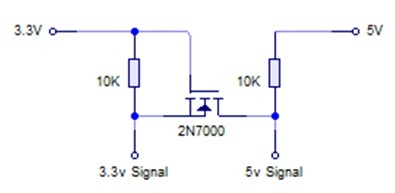

Notes
-----

Cascading, power supply & level shifting
^^^^^^^^^^^^^^^^^^^^^^^^^^^^^^^^^^^^^^^^
The MAX7219 chip supports cascading devices by connecting the DIN of one chip
to the DOUT of another chip. For a long time I was puzzled as to why this didnt
seem to work properly for me, despite spending a lot of time investigating and
always assuming it was a bug in code.

- Because the Raspberry PI can only supply a limited amount of power from the
  5V rail, it is recommended that any LED matrices are powered separately by a
  5V supply, and grounded with the Raspberry PI. It is possible to power one or
  two LED matrices directly from a Raspberry PI, but any more is likely to
  cause intermittent faults & crashes.

- Also because the GPIO ports used for SPI are 3.3V, a simple level shifter (as
  per the diagram below) should be employed on the DIN, CS and CLK inputs to
  boost the levels to 5V. Again it is possible to drive them directly by the
  3.3V GPIO pins, it is just outside tolerance, and will result in intermittent
  issues.

Despite the above two points, I still had no success getting cascaded matrices
to work properly. Revisiting the wiring, I had connected the devices in serial
connecting the out pins of one device to the in pins of another. This just
produced garbled bit patterns.

Connecting all the CS lines on the input side together and CLK lines on the
input side all together worked. The same should probably apply to GND and VCC
respectively: Only the DOUT of one device should be connected to the next
devices DIN pins.  Connecting through the output side, never worked
consistently; I can only assume that there is some noise on the clock line, or
a dry solder joint somewhere.

.. image:: images/matrix_cascaded.jpg
   :alt: max7219 cascaded
