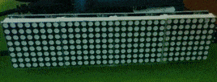

Python Usage
------------

8x8 LED Matrices
^^^^^^^^^^^^^^^^
For the matrix device, initialize the :py:class:`luma.led_matrix.device.max7219`
class, as follows:

.. code:: python

   from luma.core.serial import spi, noop
   from luma.core.render import canvas
   from luma.led_matrix.device import max7219
   
   serial = spi(port=0, device=0, gpio=noop())
   device = max7219(serial)

The display device should now be configured for use. The specific
:py:class:`luma.oled.device.max7219` class  exposes a ``display()`` method
which takes an image with attributes consistent with the capabilities of the
configured device's capabilitis. However, for most cases, for drawing text and
graphics primitives, the canvas class should be used as follows:

.. code:: python

   font = ImageFont.truetype("examples/pixelmix.ttf", 8)
 
   with canvas(device) as draw:
       draw.rectangle(device.bounding_box, outline="white", fill="black")

The :class:`luma.core.render.canvas` class automatically creates an :mod:`PIL.ImageDraw`
object of the correct dimensions and bit depth suitable for the device, so you
may then call the usual Pillow methods to draw onto the canvas.

As soon as the with scope is ended, the resultant image is automatically
flushed to the device's display memory and the :mod:`PIL.ImageDraw` object is
garbage collected.

.. note:: 
   The default Pillow font is too big for 8px high devices like the LED matrices
   here, so the `luma.examples <https://github.com/rm-hull/luma.examples>`_ repo
   inclues a small TTF pixel font called **pixelmix.ttf** (attribution: 
   http://www.dafont.com/) which just fits.

   Alternatively, a set of "legacy" fixed-width bitmap fonts are included in
   the `luma.core <https://github.com/rm-hull/luma.core>`__ codebase and may be
   used as follows:

   .. code:: python

     from luma.core.legacy import text
     from luma.core.legacy.font import proportional, CP437_FONT, LCD_FONT

     with canvas(device) as draw:
        text(draw, text="A", fill="white", font=proportional(CP437_FONT))

   The fixed-width fonts can be "converted" on-the-fly to proportionally
   spaced by wrapping them with the :py:class:`luma.core.legacy.font.proportional` 
   class.

Scrolling / Virtual viewports
"""""""""""""""""""""""""""""
A single 8x8 LED matrix clearly hasn't got a lot of area for displaying useful
information. Obviously they can be daisy-chained together to provide a longer
line of text, but as this library extends `luma.core <https://github.com/rm-hull/luma.core>`_, 
then we can use the :py:class:`luma.core.virtual.viewport` class to allow scrolling support:

.. code:: python

   import time

   from luma.core.serial import spi, noop
   from luma.core.render import canvas
   from luma.core.virtual import viewport
   from luma.led_matrix.device import max7219
   
   serial = spi(port=0, device=0, gpio=noop())
   device = max7219(serial)
   
   virtual = viewport(device, width=200, height=100)

   with canvas(virtual) as draw:
       draw.rectangle(device.bounding_box, outline="white", fill="black")
       draw.text((3, 3), text="Hello world", fill="white")

   for offset in range(8):
       virtual.set_position((offset, offset))
       time.sleep(0.1)

Calling ``set_position`` on a virtual viewport, causes the device to render
what is visible at that specific position; altering the position in a loop
refreshes every time it is called, and gives an animated scrolling effect.

By altering both the X and Y co-ordinates allows scrolling in any direction, not
just horizontally.

Color Model
"""""""""""
Any of the standard :mod:`PIL.ImageColor` color formats may be used, but since
the 8x8 LED Matrices are monochrome, only the HTML color names ``"black"`` and
``"white"`` values should really be used; in fact, by default, any value
*other* than black is treated as white. The :py:class:`luma.core.canvas` object
does have a ``dither`` flag which if set to True, will convert color drawings
to a dithered monochrome effect.

.. code:: python

  with canvas(device, dither=True) as draw:
      draw.rectangle(device.bounding_box, outline="white", fill="red")

Landscape / Portrait Orientation
""""""""""""""""""""""""""""""""
By default, cascaded matrices will be oriented in landscape mode. Should you
have an application that requires the display to be mounted in a portrait
aspect, then add a ``rotate=N`` parameter when creating the device:

.. code:: python

  from luma.core.serial import i2c
  from luma.core.render import canvas
  from luma.oled.device import ssd1306, ssd1325, ssd1331, sh1106

  serial = i2c(port=1, address=0x3C)
  device = ssd1306(serial, rotate=1)

  # Box and text rendered in portrait mode
  with canvas(device) as draw:
      draw.rectangle(device.bounding_box, outline="white", fill="black")

*N* should be a value of 0, 1, 2 or 3 only, where 0 is no rotation, 1 is
rotate 90° clockwise, 2 is 180° rotation and 3 represents 270° rotation.

The ``device.size``, ``device.width`` and ``device.height`` properties reflect
the rotated dimensions rather than the physical dimensions.

Daisy-chaining
""""""""""""""
The MAX7219 chipset supports a serial 16-bit register/data buffer which is
clocked in on pin DIN every time the clock edge falls, and clocked out on DOUT
16.5 clock cycles later. This allows multiple devices to be chained together.

If you have more than one device and they are daisy-chained together, you can
initialize the library in one of two ways, either using ``cascaded=N`` to
indicate the number of daisychained devices:

.. code:: python

   from luma.core.serial import spi, noop
   from luma.core.render import canvas
   from luma.led_matrix.device import max7219

   serial = spi(port=0, device=0, gpio=noop())
   device = max7219(serial, cascaded=3)

   with canvas(device) as draw:
      draw.rectangle(device.bounding_box, outline="white", fill="black")

Using ``cascaded=N`` implies there are N devices arranged linearly and
horizontally, running left to right.

Alternatively, the device configuration may configured with ``width=W`` and
``height=H``. These dimensions denote the number of LEDs in the all the
daisychained devices. The width *must* be a multiple of 8, and currently,
height *must* only be 8. This has future scope for arranging in blocks in, say
3x3 or 5x2 matrices.

.. code:: python

   from luma.core.serial import spi, noop
   from luma.core.render import canvas
   from luma.led_matrix.device import max7219

   serial = spi(port=0, device=0, gpio=noop())
   device = max7219(serial, width=24, height=8)

   with canvas(device) as draw:
      draw.rectangle(device.bounding_box, outline="white", fill="black")

Trouble-shooting / common problems
""""""""""""""""""""""""""""""""""
Some online retailers are selling pre-assembled `'4-in-1' LED matrix displays
<http://www.ebay.co.uk/itm/371306583204>`_, but they appear to be wired 90°
out-of-phase such that horizontal scrolling appears as below:

This can be rectified by initializing the :py:class:`luma.led_matrix.device.max7219` 
device with a parameter of ``block_orientation="vertical"``:

.. code:: python

   from luma.core.serial import spi, noop
   from luma.core.render import canvas
   from luma.led_matrix.device import max7219, sevensegment

   serial = spi(port=0, device=0, gpio=noop())
   device = max7219(serial, cascaded=4, block_orientation="vertical")

Every time a display render is subsequenly requested, the underlying image
representation is corrected to reverse the 90° phase shift.

7-Segment LED Displays
^^^^^^^^^^^^^^^^^^^^^^
For the 7-segment device, initialize the :py:class:`luma.led_matrix.device.sevensegment` 
class, and wrap it around a previously created ``max7219`` device:

.. code:: python
    
   from luma.core.serial import spi, noop
   from luma.core.render import canvas
   from luma.led_matrix.device import max7219, sevensegment

   serial = spi(port=0, device=0, gpio=noop())
   device = max7219(serial, cascaded=2)
   seg = sevensegment(device)

The **seg** instance now has a ``text`` property which may be assigned, and
when it does will update all digits according to the limited alphabet the
7-segment displays support. For example, assuming there are 2 cascaded modules,
we have 16 character available, and so can write:

.. code:: python

   seg.text = "Hello world"

Rather than updating the whole display buffer, it is possible to update
'slices', as per the below example:

.. code:: python

   seg.text[0:5] = "Goodbye"

This replaces ``Hello`` in the previous example, replacing it with ``Gooobye``.
The usual python idioms for slicing (inserting / replacing / deleteing) can be
used here, but note if inserted text exceeds the underlying buffer size, a
``ValueError`` is raised.

Floating point numbers (or text with '.') are handled slightly differently - the
decimal-place is fused in place on the character immediately preceding it. This
means that it is technically possible to get more characters displayed than the 
buffer allows, but only because dots are folded into their host character.

.. image:: images/IMG_2810.JPG
   :alt: max7219 sevensegment

WS2812 NeoPixels
^^^^^^^^^^^^^^^^
For a strip of neopixels, initialize the :py:class:`luma.led_matrix.device.neopixel`
class, supplying a parameter ``cascaded=N`` where *N* is the number of 
daisy-chained LEDs. This creates a drawing surface 100 pixels long, and lights 
up three specific pixels, and a contiguous block:

.. code:: python

   from luma.core.render import canvas
   from luma.led_matrix.device import neopixel
   
   device = neopixel(cascaded=100)

   with canvas(device) as draw:
       draw.point((0,0), fill="white")
       draw.point((4,0), fill="blue")
       draw.point((11,0), fill="orange")
       draw.rectange((20, 0, 40, 0), fill="red")

If you have a device like Pimoroni's `Unicorn pHat <https://shop.pimoroni.com/products/unicorn-phat>`_, 
initialize the device with ``width=N`` and ``height=N`` attributes instead:

.. code:: python

   from luma.core.render import canvas
   from luma.led_matrix.device import neopixel
   
   # Pimoroni's Unicorn pHat is 8x4 neopixels
   device = neopixel(width=8, height=4)

   with canvas(device) as draw:
       draw.line((0, 0, 0, device.height), fill="red")
       draw.line((1, 0, 1, device.height), fill="orange")
       draw.line((2, 0, 2, device.height), fill="yellow")
       draw.line((3, 0, 3, device.height), fill="green")
       draw.line((4, 0, 4, device.height), fill="blue")
       draw.line((5, 0, 5, device.height), fill="indigo")
       draw.line((6, 0, 6, device.height), fill="violet")
       draw.line((7, 0, 7, device.height), fill="white")

.. note::
   The neopixel driver uses the `ws2812 <https://pypi.python.org/pypi/ws2812>`_
   PyPi package to interface to the daisychained LEDs. It uses DMA (direct memory
   access) via ``/dev/mem`` which means that it has to run in privileged mode
   (via ``sudo`` root access).

The same viewport, scroll support, portrait/landscape orientation and color model
idioms provided in luma.core are equally applicable to the neopixel implementation.

Pimoroni Unicorn HAT
""""""""""""""""""""
Pimoroni sells the `Unicorn HAT <https://shop.pimoroni.com/products/unicorn-hat>`_, 
comprising 64 WS2812b NeoPixels in an 8x8 arrangement. The pixels are cascaded, but
arranged in a 'snake' layout, rather than a 'scan' layout. In order to accomodate this,
a translation mapping is required, as follows:

.. code:: python

    import time

    from luma.led_matrix.device import neopixel, UNICORN_HAT
    from luma.core.render import canvas

    device = neopixel(width=8, height=8, mapping=UNICORN_HAT)

    for y in range(device.height):
        for x in range(device.width):
            with canvas(device) as draw:
                draw.point((x, y), fill="green")
            time.sleep(0.5)

This should animate a green dot moving left-to-right down each line.

Emulators
^^^^^^^^^
There are various display emulators available for running code against, for debugging
and screen capture functionality:

* The :py:class:`luma.core.emulator.capture` device will persist a numbered PNG file to
  disk every time its ``display`` method is called.

* The :py:class:`luma.core.emulator.gifanim` device will record every image when its ``display``
  method is called, and on program exit (or Ctrl-C), will assemble the images into an
  animated GIF.

* The :py:class:`luma.core.emulator.pygame` device uses the :py:mod:`pygame` library to
  render the displayed image to a pygame display surface. 

Invoke the demos with::

  $ python examples/clock.py -d capture --transform=led_matrix

or::

  $ python examples/clock.py -d pygame --transform=led_matrix
  
.. note::
   *Pygame* is required to use any of the emulated devices, but it is **NOT**
   installed as a dependency by default, and so must be manually installed
   before using any of these emulation devices (e.g. ``pip install pygame``).

.. image:: images/emulator.gif
   :alt: max7219 emulator

